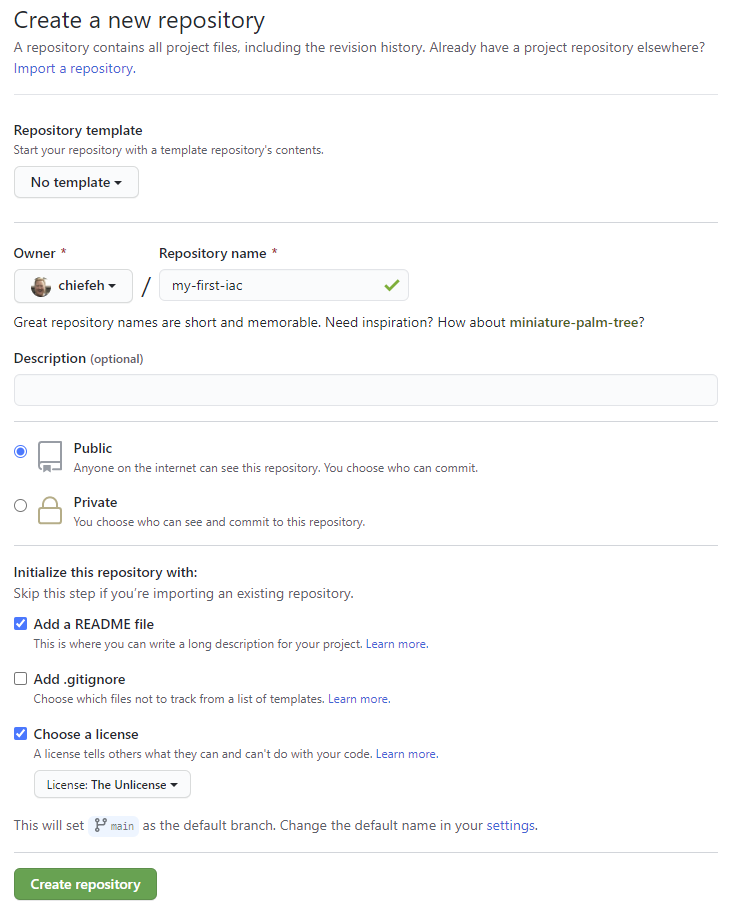
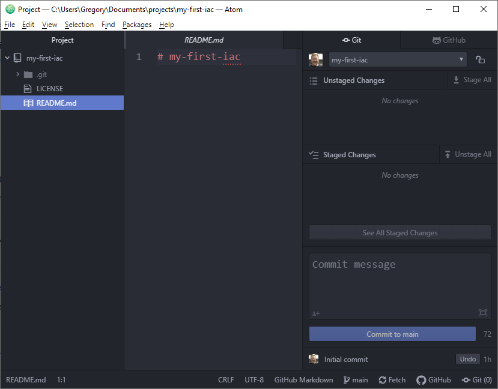

# My First Infrastructure as code

## Phase 0 - Bootstrap

### Create a Code Repository

Before building anything, need to create the repo. I will do this just by using
the GitHub website.

- Name the Repo
- Make it public to [code in the open](https://gds.blog.gov.uk/2017/09/04/the-benefits-of-coding-in-the-open/) (but also doesn't use GitHub actions minutes)
- Add a README
- Use [The Unlicense](https://unlicense.org/)
- Use "main" as the default branch (instead of [master](https://www.zdnet.com/article/github-to-replace-master-with-main-starting-next-month/))

The result creates this repository [https://github.com/chiefeh/my-first-iac](https://github.com/chiefeh/my-first-iac)



### Get the development environment ready

This document assumes the reader has git with ssh keys already setup. If not,
reference the Git part of this site. Create a new directory on the local
computer and clone the new repository.

```
PS C:\Users\Gregory\Documents\projects> git clone git@github.com:chiefeh/my-first-iac.git
Cloning into 'my-first-iac'...
Enter passphrase for key '/c/Users/Gregory/.ssh/id_rsa':
remote: Enumerating objects: 4, done.
remote: Counting objects: 100% (4/4), done.
remote: Compressing objects: 100% (3/3), done.
Receiving objects: 100% (4/4), done.
remote: Total 4 (delta 0), reused 0 (delta 0), pack-reused 0
PS C:\Users\Gregory\Documents\projects> cd .\my-first-iac\
PS C:\Users\Gregory\Documents\projects\my-first-iac> git status
On branch main
Your branch is up to date with 'origin/main'.

nothing to commit, working tree clean
PS C:\Users\Gregory\Documents\projects\my-first-iac> git remote -v
origin  git@github.com:chiefeh/my-first-iac.git (fetch)
origin  git@github.com:chiefeh/my-first-iac.git (push)
PS C:\Users\Gregory\Documents\projects\my-first-iac>
```

Add the Project Folder to Atom Editor, expand the Git panels on the right.



## Phase 1 - Building
To build the Infrastructure, I intend to use

- GitHub Actions
- A container to run Terraform
- AWS S3 to store the Terraform state file
- Another container to host a basic website with the domain
[helloworld.chiefeh.digital](https://helloworld.chiefeh.digital)
- Use a free TLS Certificate from [Lets Encrypt](https://letsencrypt.org/)

A stretch goal to only use ARM based AMI and have the container be platform
agnostic (with respect to ARM/X86). One part of this exercise is to learn containers
and look at ways of running containers on AWS.

### GitHub Actions
[GitHub Actions](https://docs.github.com/en/free-pro-team@latest/actions) is
built into GitHub and available to all account types.
